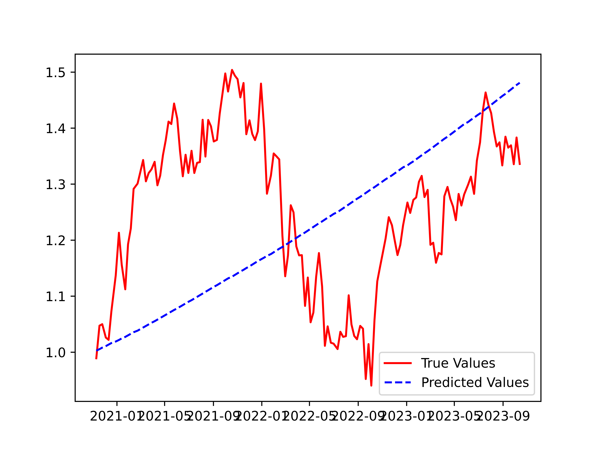

# Previsão de preço de ações bancárias

## 1. Definição do problema
No quadro de regressão supervisionada usado para este projeto, a variável prevista é o retorno semanal das ações da JPM (JPMorgan Chase & Co.). Precisamos identificar o preço da ação da JPM no próximo dia dado os valores anteriores para que podemos analisar o risco e lucrabilidade antes mesmo de realmente injetar capital nesse ativo. 

### 1.1. Solução
Aqui queremos identificar uma possível oportunidade de compra da ação da JPM, assim o modelo é responsável por tentar capturar possível aumento e vamos nos auxiliar do modelo de inteligência artificial Llama2 que se passará por um analista de investimento e tem como intuito analisar as previsões para sugerir a tomada de decisão de compra ou não compra.

## 2. Sobre os dados
As informações empregadas nesta iniciativa foram obtidas através da extração de dados do Yahoo Finance, abrangendo as ações e quanto as taxas de câmbio e dos índices, foram obtidos no FRED (Federal Reserve Bank) e é importante ressaltar que estaremos utilizado dados da cotação no fechamento diário. O escopo temporal também desempenha um papel relevante, e para isso, coletaremos dados abrangendo o intervalo de janeiro de 2010 a outubro de 2023, abrangendo dias completos de ambos os meses finais.

Para este projeto, além dos dados históricos da JPM, as variáveis independentes utilizadas são as seguintes ativos potencialmente correlacionados:

- Ações:
   - Bank of America Corporation (BAC) e Wells Fargo & Company (WFC)
- Taxa de câmbio:
   - USD/UK e USD/EUR
- Índices:
   - S&P 500, Dow Jones e VIX

Após a conclusão do processo de coleta e as devidas etapas de limpeza, incluindo a remoção de dados faltantes, o conjunto de dados resultante será composto por oito colunas, sendo que o nome de cada coluna corresponde ao ticker que identifica cada um dos ativos.

## 3. Análise dos dados

### 3.1. Mostra dos dados
A tabela apresentada abaixo compreende os resultados derivados de uma coleta de dados minuciosa, reunindo informações cruciais referentes aos valores das ações de diversos bancos, indicadores de mercado selecionados e, por fim, as cotações cambiais entre o dólar e as moedas britânica e europeia.

A série de dados abrange um período abrangente, estendendo-se do ano de 2013 até Outubro/2023. Contudo, é imperativo salientar que o conjunto de informações pode ter sofrido algumas exclusões ao longo do processamento, motivadas pela detecção de valores ausentes. Nesse sentido, foi conduzida uma etapa de depuração dos dados, visando à eliminação de quaisquer registros que pudessem conter lacunas informacionais.

|      Dates |        JPM |       BAC |       WFC | DEXUSUK | DEXUSEU |  SP500 |     DJIA | VIXCLS |
|-----------:|-----------:|----------:|----------:|--------:|--------:|-------:|---------:|-------:|
| 2013-08-23 |  39.576180 | 12.223401 | 32.090580 |  1.5578 |  1.3392 | 1663.5 | 15010.51 |  13.98 |
| 2023-10-20 | 142.949997 | 26.309999 | 40.270000 |  1.2153 |  1.0592 | 4224.16 | 33127.28 |  21.71 |
								
### 3.2. Resumo dos dados
A tabela anterior é feito o resumo numérico de cada variável dos dados, alguns pontos importantes para se destacar da tabela:
- A média do do preço da ação de JPM (JPMorgan Chase) é de aproximadamente 85.66, com um desvio padrão de 34.20.
- A média do do preço da ação de BAC (Bank of America) é cerca de 23.42, com um desvio padrão de 9.35.
- A média do do preço da ação de WFC (Wells Fargo) é de cerca de 41.02, com um desvio padrão de 6.92.
- Há diferenças notáveis nas médias dos diferentes bancos (JPM, BAC, WFC), sugerindo que eles podem ter diferentes níveis de desempenho ou tamanho no mercado financeiro.
- O DJIA (Dow Jones Industrial Average) tem um valor mínimo de 14776.13 e máximo de 36799.65, indicando a faixa de flutuação do índice ao longo do período.
- O VIXCLS (Índice de Volatilidade CBOE) tem um valor mínimo de 9.14 e máximo de 82.69, mostrando a gama de volatilidade percebida nos mercados financeiros.

### 3.3. Comportamento da variável alvo (JPM)
A imagem abaixo disponibiliza a visualização dos preços da ação da variável alvo ao decorrer do tempo, e assim podemos identificar a sua tendência e sazonalidade.


### 3.4. Relação variável alvo e ativos
#### 3.4.1. Bancos


É notável e relevante observar que nos gráficos anteriores, há uma clara comparação entre o preço da ação que será objeto de previsão (no caso, JPM) com os preços das ações de seus concorrentes (BAC e WFC). Uma análise mais detalhada revela padrões notáveis de comportamento entre JPM e BAC, indicando uma certa similaridade em suas trajetórias de preço ao longo do tempo. Isso pode sugerir uma correlação ou influências compartilhadas entre esses dois ativos, possivelmente devido a fatores do setor financeiro ou condições econômicas mais amplas.

Além disso, a diferença entre JPM e WFC, apesar de notável em termos de valores absolutos, destaca uma tendência semelhante em termos de padrões de aumento ou queda. Essa semelhança na direção das flutuações pode indicar uma sensibilidade compartilhada a eventos macroeconômicos ou fatores do mercado que afetam ambos os ativos de maneira semelhante.

#### 3.4.2. Taxa de câmbio


É possível notar que as cotações entre dólares, libras e euros podem apresentar desafios na extração imediata de informações impactantes, devido à complexidade de fatores que influenciam as taxas de câmbio. Dado o caráter multifacetado das dinâmicas cambiais, a abordagem de análise pode se estender para além de observações visuais diretas.

Explorar métodos adicionais, como análise de correlação, testes de hipóteses e algoritmos de machine learning, pode ser uma abordagem promissora para desvendar padrões e relações subjacentes nos dados cambiais. A análise de correlação pode revelar graus de associação entre as diferentes taxas de câmbio, ajudando a identificar se há momentos em que elas se movem de forma coordenada ou divergente.

#### 3.4.3. Índices


O insight aqui é que existe uma possibilidade de que os indíces SP500, DJIA e VIXCLS sejam capaz de auxiliar na predição, dado que os comportamentos estão alinhados, portanto o uso dessas variável podem vir ser essencial para o projeto.

## 3.5. Correlação


Olhando o gráfico de correlação, podemos identificar uma alta correlação positiva entre a variável alvo (JPM) com os indíces, e também uma correlação negativa com as taxas de câmbios. 

## 3.6. Time Series

No primeiro resultado, o Teste Estatístico ADF registrou um valor de -1.01. O P-Value associado a esse teste foi de 0.75. Esses resultados indicaram que a série temporal em questão não era estacionária. Isso significa que a série apresentava uma estrutura dependente do tempo, sugerindo a presença de padrões sazonais. A alta probabilidade (P-Value de 0.75) de não estacionariedade indicou que a série possuía tendências ou flutuações que a tornavam não adequada para análises que pressupõem estacionariedade.

No entanto, após realizar um procedimento de reenquadramento da série temporal, os resultados foram significativamente diferentes. O Teste Estatístico ADF agora apresentou um valor de -13.79, uma mudança drástica em relação ao resultado anterior. O P-Value associado a esse teste foi de 0.00, indicando que era estatisticamente significativo. Nesse contexto, um P-Value inferior a 0.05 é comumente usado como critério para determinar a estacionariedade.

# 4. Treinamento dos modelos

## 4.1. Preparação dos dados

Dado que temos o objetivo de olhar a semana, para cada variável independente foi criada uma variável lagged de, 5 dias, 15 dias, 30 dias e 60 dias. As variáveis lagged de cinco dias incorporam o componente de série temporal usando uma abordagem de atraso de tempo, onde a variável defasada é incluída como uma das variáveis ​​independentes. Esta etapa consiste em reformular os dados da série temporal em uma estrutura de modelo supervisionado baseado em regressão.

## 4.2. Modelos treinados

Foram utilizados diversos modelos de machine learning, abaixo nós podemos comparar o resultado da métrica de performance do modelo para cada um para cada partição de dados entre treino e teste, além disso, é importante ressaltar que foi utilizado o método de cross-validation para evitar problemas de vazamento de dados.


Analisando o gráfico acima, ainda temos que os algoritmos lineares (LASSO e EN) estão melhor performando, isso pode ser principalmente devido uma forte relação linear entre as variáveis. Assim o modelo escolhido será o regressão linear Lasso, e este passará por uma etapa de escolha dos melhores hiperparâmetros.

## 4.3. Resultados

Ao observar o gráfico abaixo, fica claro que a tendência está sendo capturada pelo modelo, dado que o modelo é uma linha de regressão. A série prevista é menos volátil em comparação com a série temporal real e se alinha aos dados reais nos primeiros meses do conjunto de testes e no final do ano de 2022. Vale destacar que o objetivo do modelo é calcular o retorno do próximo dia com base nos dados observados até o dia presente, e não prever o preço das ações vários dias no futuro com base nos dados atuais. Portanto, é esperado um desvio em relação aos dados reais à medida que nos afastamos do início do conjunto de testes. O modelo parece ter um bom desempenho nos primeiros meses, mas o desvio em relação aos dados reais aumenta nos anos posteriores.



# 5. Consumo do modelo

Como foi definido no começo, o consumo do resultado modelo será repassado para uma IA realizar as análises e assim tenha a capacidade para que seja possível a sugestão de compra. Para tal, a plataforma de consumo será o Streamlit que terá a responsabilidade de enviar as predições realizadas pelo modelo para a Replicate realizar as predições com o modelo em cloud Llama 2, abaixo é possível ver o exemplo de uso.


# 6. Como rodar o projeto

Para executar esse projeto e visualizar ele em execução, devemos:
- Etapa de ambiente
1. Possuir o Python instalado na versão 3.10.12 **``` conda create -n venv python=3.10.12 ```**
2. Clonar o repositório do [(GitHub)](https://github.com/mathdeoliveira/stock_price_prediction.git)
3. Entrar no diretório raiz **```/stock_price_prediction```**
4. Instalar o arquivo requirements.txt **```pip install -r requirements.txt```**
   
- Executar o projeto
1. Você precisa possuir a capacidade de executar o Makefile
2. Executar o comando no terminal **```make run```**

- Atuar em conjunto com a IA
1. Ter uma conta no [Replicate](https://replicate.com/signin/)
2. Copiar a Key da API no Menu
3. Colar a Key no Streamlit que se abriu na etapa: Executar o projeto